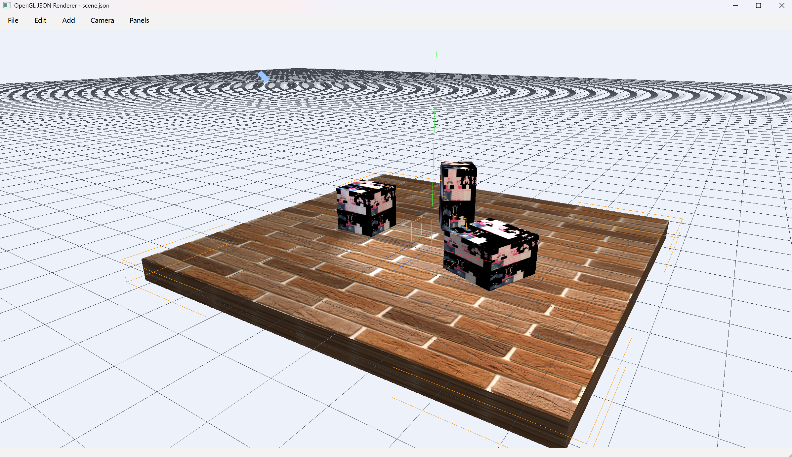
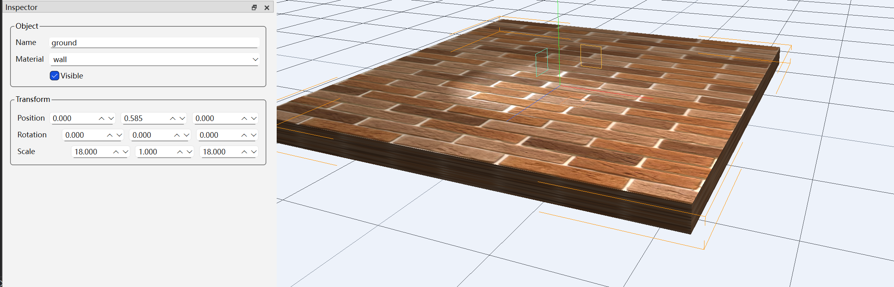
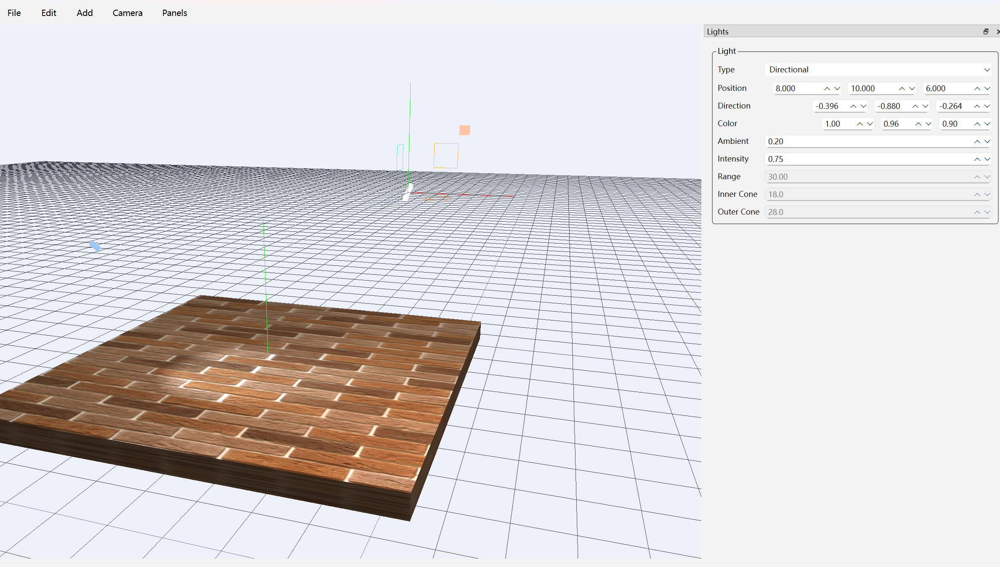
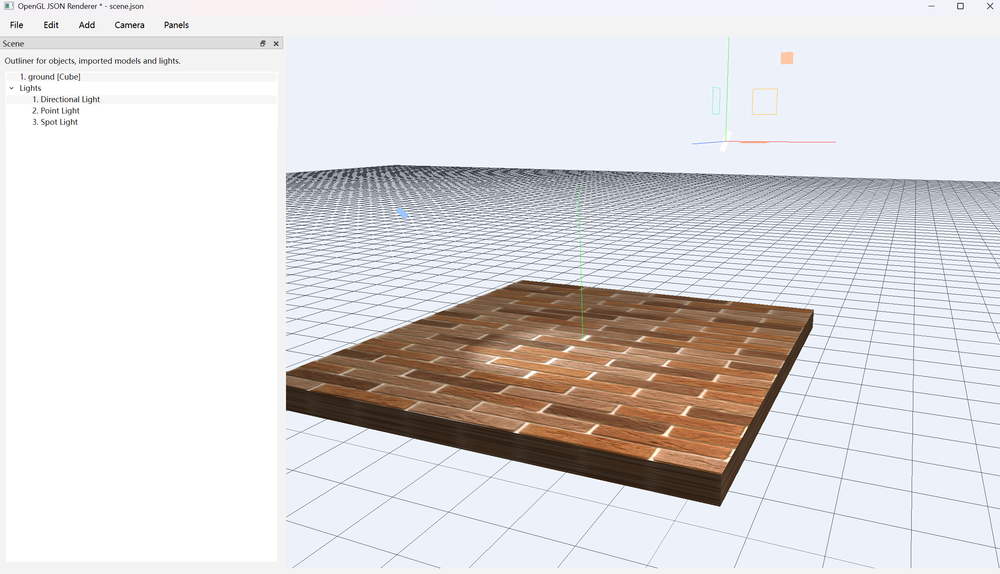

# Qt / OpenGL Scene Editor

基于 `Qt 6`、`OpenGL 4.5`、`Assimp` 和 `GLM` 的桌面 3D 场景编辑器。项目以“场景编辑器 + 渲染后端分层”为目标，当前支持 JSON 场景配置、模型导入、层级场景管理、Gizmo 交互编辑、多光源实时光照，以及基础的编辑器文档/撤销重做流程。

## 项目定位

这个项目不是单纯的 OpenGL 渲染示例，而是一个可继续扩展的编辑器原型，重点在两部分：

- 编辑器层：场景树、属性检查器、灯光参数面板、相机与工具面板、菜单命令、撤销重做、保存与重载
- 渲染层：资源管理、场景编译、Render Item 生成、实时绘制、调试辅助渲染

## 当前功能

- JSON 场景加载、保存、重载
- 场景中立方体对象的创建与编辑
- `Assimp` 模型导入，支持多材质槽映射
- 场景树展示对象与灯光
- 层级父子关系与世界变换计算
- Inspector 中直接编辑名称、材质、显隐、位移、旋转、缩放
- 视口中使用 Gizmo 进行平移、旋转、缩放
- 世界坐标 / 局部坐标切换
- 吸附编辑与步长设置
- 多选、复制、粘贴、复制实例、删除
- 相机聚焦选中对象、重置相机
- 方向光、点光、聚光灯实时光照
- 灯光参数编辑，包括颜色、强度、范围、锥角、方向
- 网格、坐标轴、灯光标记等调试辅助显示
- 撤销 / 重做与文档脏状态跟踪

## 渲染与编辑器架构

当前代码已经开始将编辑器逻辑和渲染后端拆分：

### 编辑器层

- `MainWindow`
  负责 UI 组装、菜单命令分发、各个 dock 面板同步
- `SceneDocument`
  负责场景文档状态、撤销重做、保存/重载、脏状态管理
- `SceneEditorService`
  负责对象和灯光的增删改、复制粘贴、选择结果回传

### 场景数据层

- `SceneConfig`
  场景序列化结构，统一持有窗口、相机、材质、灯光、对象、调试配置
- `SceneGraph`
  负责层级关系、对象 ID、父子树遍历与变换链辅助计算

### 渲染层

- `RenderSceneBackend`
  连接场景配置与渲染后端
- `RenderResourceManager`
  管理纹理、模型、网格等运行时资源
- `RenderSceneCompiler`
  将场景对象解析为可直接绘制的 `RenderItem`
- `SceneRenderer`
  消费编译后的场景并执行实际绘制
- `RenderWidget`
  负责 OpenGL 上下文、视口交互、拾取、Gizmo 与调试渲染

整体链路可以概括为：

`SceneConfig / RenderObject` -> `RenderSceneBackend` -> `RenderResourceManager` -> `RenderSceneCompiler` -> `SceneRenderer`

## 目录结构

```text
.
|- assets/
|  |- config/scene.json
|  |- shaders/
|  `- textures/
|- src/
|  |- main.cpp
|  `- app/
|     |- MainWindow.*
|     |- SceneConfig.*
|     |- SceneDocument.*
|     |- SceneEditorService.*
|     |- SceneGraph.*
|     |- RenderWidget.*
|     |- RenderSceneBackend.*
|     |- RenderResourceManager.*
|     |- RenderSceneCompiler.*
|     |- SceneRenderer.*
|     `- ModelLoader.*
|- thirdparty/
|  `- include/
`- CMakeLists.txt
```

## 开发环境

当前工程按 Windows 开发环境配置，默认构建条件如下：

- Windows 10 / 11
- Visual Studio 2022 + MSVC
- CMake `>= 3.21`
- Qt `6.9.3` `msvc2022_64`
- OpenGL `4.5 Core Profile`


## 构建

### 1. 配置

```powershell
cmake -S . -B out/build/x64-Debug `
  -G "Visual Studio 17 2022" `
  -A x64 `
  -DFLOWCHART_EDITOR_QT_PREFIX=D:/Qt/6.9.3/msvc2022_64
```

### 2. 编译

```powershell
cmake --build out/build/x64-Debug --config Debug
```

### 3. 运行

```powershell
.\out\build\x64-Debug\openglStudy.exe
```

说明：

- 启动时程序默认加载 `assets/config/scene.json`
- `assets/` 会在构建后自动复制到输出目录
- 如果检测到 `windeployqt`，CMake 会在构建后自动部署 Qt 运行库

## 使用说明

### 主要菜单

- `File`
  保存场景、重载场景
- `Edit`
  撤销、重做、复制、粘贴、复制实例、删除选中
- `Add`
  添加立方体、导入模型、添加灯光
- `Camera`
  聚焦选中对象、重置相机
- `Panels`
  恢复默认布局、显示全部面板、切换各个 dock

### 视口交互

- `W / E / R`
  切换平移 / 旋转 / 缩放 Gizmo
- `Left Click`
  选择对象或拖动 Gizmo
- `Left Drag`
  在空白区域框选
- `Middle Drag`
  平移视图
- `Alt + Left Drag`
  环绕观察
- `Mouse Wheel`
  缩放
- `Right Hold + W A S D Q E`
  相机飞行移动
- `Shift + Drag`
  临时启用吸附
- `F`
  聚焦当前选中
- `Home`
  重置相机

### 1. 主界面总览



### 2. Gizmo 编辑


### 3. 灯光参数编辑



### 4. 模型导入与场景树



## 已知限制

- 当前工程主要面向 Windows + MSVC 环境
- `Assimp` 二进制库路径仍是本地目录约定，不够通用
- 目前以正向渲染和编辑器原型为主，尚未加入更完整的渲染管线功能
- README 中的截图占位需要后续替换为真实运行画面

## 后续可继续扩展的方向

- 阴影贴图
- 后处理与 HDR
- 更完整的材质系统
- 计算着色器驱动的 GPU 功能
- 更彻底的资源数据库与场景文档分层
- 更完善的测试与工程化打包
